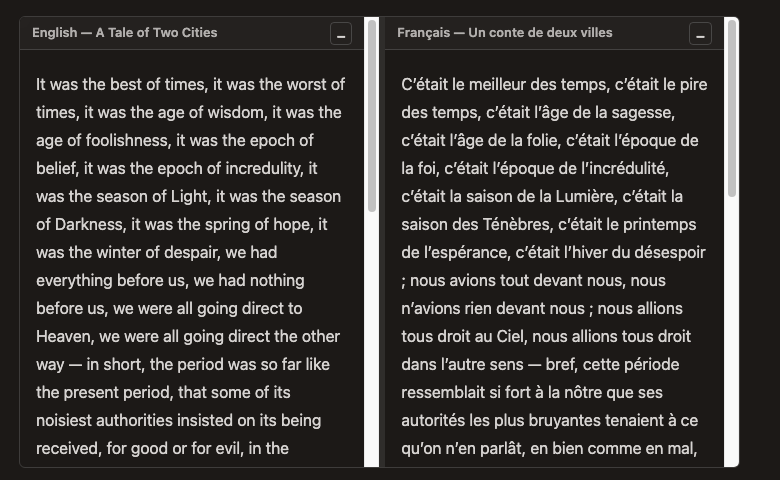

# myst-side-by-side

A [MyST Markdown](https://mystmd.org) directive/transform plugin that renders
two versions of a document — an original and its translation — in linked,
scrollable panels.



## Features

- **Side-by-side panels** with independent scrolling, a draggable divider
  (double-click to reset), and per-panel minimize/restore.
- **Click-to-jump navigation**: click any passage and the other panel scrolls
  to the paired hook and briefly flashes it.
- **The `.old` / `.new` contract**: author-specified labels sharing a stem
  (`opening.old` ↔ `opening.new`, or `opening_old` / `opening_new`) pair
  corresponding passages — the documents do *not* need matching structure.
- **Paired numbering**: equations labeled with matching stems display the
  *same* number in both panels and consume one slot in the page-wide
  sequence; unpaired equations stay unnumbered, as is conventional.
- **Side-tagged figures**: a translation may drop or add figures, so labeled
  panel figures are numbered by side — a matched pair shares its index
  (*Figure O.1* ↔ *Figure N.1*) and a figure without a counterpart keeps its
  own slot (*Figure N.2* with no O.2). All of them stay cross-referenceable.
- **Footnotes & comments**: matched footnotes (`[^note.old]` ↔ `[^note.new]`)
  are numbered as a pair, tagged by side (O.1 / N.1); footnotes without a
  counterpart become translator *comments* (C.1, C.2, …) collected in their
  own section below the footnotes. Hover popovers keep working.
- **Build-time validation**: hooks without a counterpart produce warnings, so
  a translation that drifts out of sync with its original is caught early.
- **No theme fork**: the interactivity ships as an
  [AnyWidget](https://anywidget.dev) module rendered by MyST's built-in
  `anywidget` support in the core themes.

## Requirements

- `mystmd` ≥ 1.10 (the plugin emits the `anywidget` AST node, alpha as of
  mystmd 1.10).
- A site template that renders anywidget nodes (`book-theme` and
  `article-theme` do).

## Installation

Add the plugin URL to your `myst.yml` — nothing to copy. MyST fetches and
caches both the plugin and its client widget at build time, so a clean build
always pulls the latest version:

```yaml
# myst.yml
project:
  plugins:
    - https://raw.githubusercontent.com/curiousbeams/myst-side-by-side/main/side-by-side.mjs
```

To pin a version, replace `main` in the URL with a tag or commit SHA (and
pass the matching widget URL via the `:widget:` option).

### Local installation (offline builds, development)

Alternatively, copy the two files into your MyST project:

- [`side-by-side.mjs`](side-by-side.mjs) — the directive and its two
  transforms (register this one in `myst.yml` by path, as above);
- [`side_by_side_widget.mjs`](side_by_side_widget.mjs) — the client widget.
  It is picked up automatically when it sits next to the page that uses the
  directive; otherwise point the `:widget:` option at it (any path relative
  to the page, or a URL).

## Usage

Point the directive at the two documents, exactly like `{include}`:

```markdown
:::{side-by-side}
:old: ./old/chapter_one.md
:new: ./new/chapter_one.md
:max-height: 450px
:old-title: English — A Tale of Two Cities
:new-title: Français — Un conte de deux villes
:::
```

### Options

| Option                    | Default                     | Description                                                            |
| ------------------------- | --------------------------- | ---------------------------------------------------------------------- |
| `old` (required)          | —                           | Path to the original document, relative to the page (like `{include}`) |
| `new` (required)          | —                           | Path to the translated document                                         |
| `max-height`              | `500px`                     | Panel height cap (any CSS length); use `none` to let the panels grow    |
| `split`                   | `50%`                       | Initial width of the left (old) panel; the divider stays draggable      |
| `highlight`               | `true`                      | Flash the paired block after a click-to-jump                            |
| `old-title` / `new-title` | the file names              | Panel header titles                                                     |
| `widget`                  | auto                        | Path or URL of the AnyWidget ESM module; defaults to `side_by_side_widget.mjs` next to the page if present, else the published module on GitHub |
| `class`                   | —                           | Extra CSS classes for the container                                     |

Snake-case aliases are accepted (`max_height`, `old_title`, `new_title`, and
`proportional_width` for `split`).

### The contract, by content type

| Content   | Original                | Translation             | Result                                                      |
| --------- | ----------------------- | ----------------------- | ----------------------------------------------------------- |
| Paragraph | `(opening_old)=`        | `(opening_new)=`        | Click-to-jump anchor between the panels                     |
| Equation  | `\label{eq_a.old}`      | `\label{eq_a.new}`      | Same number in both panels, one slot in the global sequence |
| Figure    | `:label: fig_a.old`     | `:label: fig_a.new`     | Shared index, tagged by side: Figure O.1 / Figure N.1; unpaired figures keep their own slot |
| Footnote  | `[^note.old]`           | `[^note.new]`           | Paired numbering, tagged by side: O.1 / N.1                 |
| Footnote  | `[^anything]` (no pair) | `[^anything]` (no pair) | Translator comment: C.1, C.2, … in a separate section       |

Cross-references (`@eq_a.old`, `@eq_a.new`, `@fig_a.old`, …) resolve on both
sides to the shared number.

## Demo

This repository is itself a MyST site showcasing every feature with an
English → French example:

```sh
npm install -g mystmd   # or: pip install mystmd
myst start
```

- **Overview & basic usage** — the directive, hooks, interactions, options.
- **Equations, figures, footnotes & comments** — the numbering contract,
  including multiple side-by-side blocks per page.

## How it works

- The **directive** emits a `div` container holding two panels (each wrapping
  a standard `include` node, so MyST's own machinery loads the files) plus an
  `anywidget` node carrying the options.
- A **document-stage transform** pairs `.old`/`.new` hooks per container,
  warns about unmatched ones, excludes new-side and unpaired equations from
  global numbering, assigns the side-tagged figure numbers, applies the
  footnote contract, and writes the pair map into the widget model.
- A **project-stage transform** runs after MyST's global enumeration and
  mirrors each old-side equation number onto its new-side twin, patching
  already-resolved cross-references.
- The **widget** (AnyWidget contract) applies the flex layout, headers,
  divider, click-to-jump, and restyles the theme's footnote footer with the
  side-tagged markers, cloning it for the Comments section.

## Limitations

- The Comments section is built client-side, so it exists on the website
  only; PDF/Word exports fall back to ordinary footnotes with C.x markers.
- Cross-page references to `.new` labels render without a number (the mirror
  map is per page).
- Footnote labels must be unique across the two documents shown on one page.
- A site-wide `numbering.enumerator` template (e.g. `15.%s`) is respected by
  paired equations (the mirrored side copies the templated number) and by all
  host-page content, but the side-tagged markers (Figure O.X / N.X, footnote
  O.X / N.X / C.X) are panel-scoped by design and do not take the prefix.
- mystmd's anywidget support is alpha; if its node shape changes, only the
  emit site in `side-by-side.mjs` needs updating.

## License

[MIT](LICENSE)
